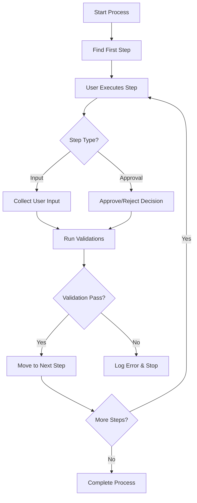
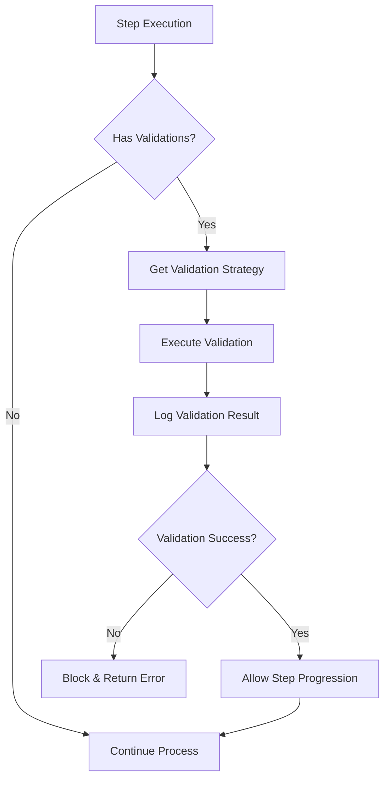

# NanoHealthSuite - Workflow Tracking System

A comprehensive .NET Core workflow management system that allows organizations to define, manage, and track complex business processes with custom validation and user role-based assignments.

## 🚀 Features

### Core Workflow Management
- **Dynamic Workflow Creation**: Define workflows with multiple sequential steps
- **Role-Based Assignment**: Assign workflow steps to specific user roles
- **Step Types**: Support for Input and Approval/Reject step types
- **Smart Step Linking**: Robust TempId-based step linking with order validation

### Process Execution
- **Process Lifecycle Management**: Start, execute, and track processes through workflow steps
- **Action Types**: Submit (for input steps), Approve/Reject (for approval steps)
- **Structured Input Handling**: Collect structured data with field names, values, and types
- **Audit Trail**: Complete execution history with comments and timestamps

### Security & Authentication
- **JWT Authentication**: Secure API access with role-based authorization
- **User Context**: Process actions tied to authenticated users
- **Role Validation**: Users can only execute steps assigned to their role

## 🏗️ Architecture

### Technology Stack
- **.NET 8**: Modern C# with latest features
- **Entity Framework Core**: Database ORM with PostgreSQL support
- **JWT Bearer Authentication**: Secure API authentication
- **Strategy Pattern**: For extensible validation system
- **Repository Pattern**: Clean data access layer
- **Dependency Injection**: Built-in .NET DI container

### Project Structure
```
NanoHealthSuite/
├── NanoHealthSuite.Data/           # Data layer (models, repositories, context)
├── NanoHealthSuite.TrackingSystem/ # Business logic and services
├── NanoHealthSuite.TrackingSystem.Api/ # Web API controllers
├── NanoHealthSuite.Shared/         # Shared utilities and models
└── WorkflowSystemTests.http        # Comprehensive API tests
```

## 📋 System Flow

### 1. Process Execution Flow


### 2. Validation System Flow


## 🛠️ Installation & Setup

### Prerequisites
- .NET 8 SDK or later
- PostgreSQL 12+ database
- Visual Studio 2022 / VS Code / JetBrains Rider

### 1. Clone Repository
```bash
git clone https://github.com/yourusername/NanoHealthSuite.git
cd NanoHealthSuite
```

### 2. Database Setup
```bash
# Update connection string in appsettings.json
{
  "ConnectionStrings": {
    "WorkflowDb": "server=localhost;database=nano-workflow;Port=5432;User Id=postgres;Password=yourpassword"
  }
}

# Run database migrations
dotnet ef database update --project NanoHealthSuite.Data
```

### 3. Configure JWT Settings
```json
{
  "JWTSettings": {
    "Secret": "your-super-secret-key-at-least-256-bits-long",
    "ValidIssuer": "nano",
    "ValidAudience": "nano",
    "LifeTimeInMinutes": 60
  }
}
```

### 4. Run the Application
```bash
# Start the API
cd NanoHealthSuite.TrackingSystem.Api
dotnet run

# The API will be available at: https://localhost:7001
```

### 5. Test the System
Use the provided `WorkflowSystemTests.http` file to test all functionality:
- Authentication
- Workflow creation
- Process execution
- Validation system
- Process retrieval

## 🎯 API Endpoints

### Authentication
- `POST /api/v1/authentication/login` - User login
- `POST /api/v1/authentication/register` - User registration

### Workflows
- `POST /api/v1/workflows` - Create new workflow
- `GET /api/v1/workflows/{id}` - Get workflow details

### Processes
- `POST /api/v1/processes/start/{workflowId}` - Start new process
- `POST /api/v1/processes/execute` - Execute process step
- `GET /api/v1/processes` - Get processes (with filters)

## 🔧 Key Design Decisions

### 1. Step Linking Strategy
**Decision**: Use TempId-based linking instead of name-based linking
**Rationale**: 
- Prevents errors from typos in step names
- Supports step renaming without breaking workflows
- Enables order validation (steps can only link forward)
- More maintainable and less error-prone

**Implementation**:
```csharp
public class NewWorkflowStepDto
{
    public string TempId { get; set; }           // Unique within request
    public int Order { get; set; }               // Sequential ordering
    public string NextStepTempId { get; set; }   // Reference to next step
}
```

### 2. Input Data Structure
**Decision**: Unified UserInput structure with field metadata
**Rationale**:
- Type-safe input collection
- Supports various field types (text, number, date, boolean)
- Easy UI generation from field metadata
- Consistent data storage format

**Implementation**:
```csharp
public class UserInput
{
    public string FieldName { get; set; }    // "amount", "reason"
    public string FieldValue { get; set; }   // "5000", "New equipment"
    public string FieldType { get; set; }    // "number", "text"
}
```

### 3. Validation System Architecture
**Decision**: Strategy Pattern with factory-based DI
**Rationale**:
- Extensible - easy to add new validation types
- Testable - strategies can be mocked individually
- Maintainable - separation of concerns
- Configurable - validation types registered via DI

**Implementation**:
```csharp
services.AddScoped<Func<CustomValidationType, IProcessStepValidationStrategy>>(
    serviceProvider => validationType => GetValidationStrategy(serviceProvider, validationType)
);
```

### 4. JWT Authentication Strategy
**Decision**: Comprehensive JWT with issuer/audience validation
**Rationale**:
- Security best practices with full token validation
- Stateless authentication suitable for APIs
- Role-based authorization support
- Scalable for microservices architecture

### 5. Result Pattern Usage
**Decision**: Consistent Result<T> pattern for operation outcomes
**Rationale**:
- Explicit success/failure handling
- Rich error information
- Functional programming principles
- Consistent API responses

## 🧪 Testing

### Automated Testing
The project includes comprehensive HTTP tests in `WorkflowSystemTests.http`:
- Authentication flow
- Complete workflow creation (5 steps with validation)
- Process execution with all action types
- Error scenarios and validation
- Process retrieval with filters

### Manual Testing Steps
1. Run the API locally
2. Open `WorkflowSystemTests.http` in VS Code with REST Client extension
3. Execute tests in order (variables chain between requests)
4. Verify database state after each major operation

## 🙏 Acknowledgments

- Built as a technical assessment project
- Demonstrates modern .NET practices and patterns
- Showcases enterprise-grade workflow management capabilities

---

## 📞 Support

For questions or support, please open an issue in the GitHub repository.
